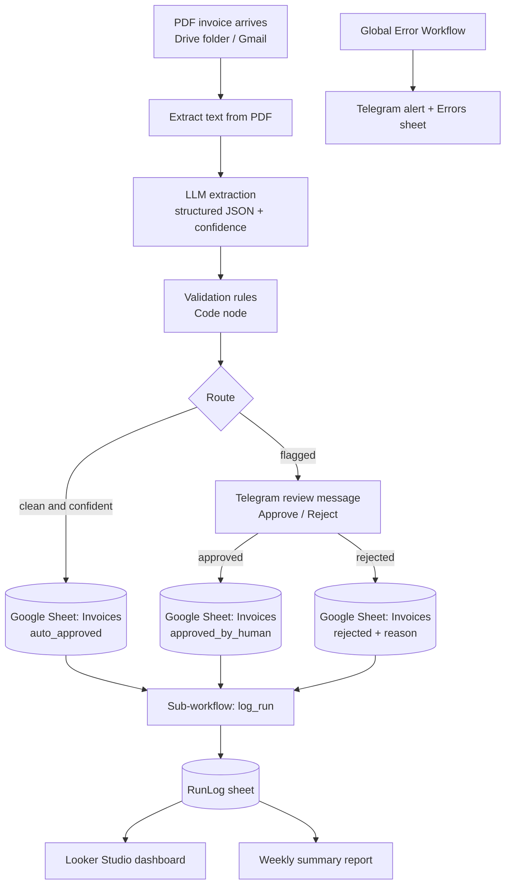

# LedgerLens

AI-powered invoice intake with human-in-the-loop review and a built-in automation ROI monitor.
Built with [n8n](https://n8n.io) (self-hosted Community Edition), Google Gemini, Telegram, and Google Sheets. Runs entirely on free tiers.

> #Demo video:  | Dashboard screenshot:

---

## Motivation

Small and mid-sized companies still process invoices by hand: open the PDF, retype the fields, check the maths, hope nothing is a duplicate. It is slow, error-prone, and nobody measures what it costs.

## Solution

LedgerLens automates the routine cases and escalates the risky ones to a human, while measuring the time and money saved.

- **Extracts** structured data from PDF invoices (German and English) using an LLM.
- **Validates** every result with deterministic business rules, because LLM output is never trusted blindly.
- **Routes** by confidence: clean invoices are booked automatically, doubtful ones go to a human via Telegram with Approve/Reject buttons.
- **Monitors** itself: central error alerts, per-run logging, and an ROI dashboard.

## Architecture



## Workflows

| # | Workflow | Purpose |
|---|----------|---------|
| 01 | `invoice_intake` | Trigger, extract, LLM parse, validate, route |
| 02 | `human_review` | Telegram approval flow for flagged invoices |
| 03 | `log_run` (sub-workflow) | Writes run metrics and ROI to `RunLog` |
| 04 | `global_error_handler` | Catches failures from any workflow, alerts and logs |
| 05 | `weekly_report` | Scheduled summary of volume, savings, and errors |

## Extracted data schema

```json
{
  "vendor_name": "string",
  "vendor_vat_id": "string | null",
  "invoice_number": "string",
  "invoice_date": "YYYY-MM-DD",
  "due_date": "YYYY-MM-DD | null",
  "currency": "EUR",
  "net_amount": 0.00,
  "vat_rate": 19,
  "vat_amount": 0.00,
  "gross_amount": 0.00,
  "confidence": 0.0
}
```

## Validation and routing rules

An invoice is approved automatically only if all checks pass. Otherwise it goes to human review with a list of failed rules.

- All required fields are present.
- Dates parse correctly and the invoice date is not in the future.
- `net + VAT = gross` within a tolerance of 0.02.
- VAT rate is one of 0 %, 7 %, 19 %.
- No duplicate of the same vendor + invoice number.
- Gross amount is at or below the approval threshold (default 5,000 EUR).
- LLM confidence is at least 0.80.

## ROI model (Assumptions)

Configurable assumptions (edit in the `log_run` sub-workflow):

| Parameter | Default |
|-----------|---------|
| Manual processing time per invoice | XX min |
| Time saved, auto-approved | XX min |
| Time saved, human-reviewed | XX min |
| Hourly labour cost | XX EUR |

These are assumptions, not measurements. 

## Results

Evaluated on **N** synthetic invoices with known ground truth (`eval/ground_truth.csv`), including deliberate edge cases (wrong totals, duplicates, missing VAT ID, foreign currency, messy layouts).

| Metric | Result |
|--------|--------|
| Field-level extraction accuracy | XX % |
| Invoices auto-approved | XX % |
| Incorrect auto-approvals (false approvals) | XX |
| Edge cases correctly flagged | XX / XX |
| Estimated time saved per 100 invoices | XX h |

## Tech stack

- **Orchestration:** n8n Community Edition (Docker)
- **LLM:** Google Gemini (free tier)
- **Human-in-the-loop:** Telegram Bot API
- **Storage:** Google Sheets
- **Reporting:** Looker Studio
- **Test data:** Python (Faker, reportlab)

## Setup

### Prerequisites

- Docker
- A Google account (Sheets, Drive, and a Gemini API key from Google AI Studio)
- A Telegram bot token (via @BotFather) and your chat ID

### Run n8n

```bash
docker volume create n8n_data
docker run -it --rm --name n8n -p 5678:5678 \
  -v n8n_data:/home/node/.n8n \
  docker.n8n.io/n8nio/n8n
```

Open http://localhost:5678.

### Configure

1. Copy `.env.example` to `.env` and fill in your values.
2. Create the Google Sheet with tabs `Invoices`, `RunLog`, `Errors`.
3. In n8n, create credentials for Google Sheets, Google Drive (or Gmail), Gemini, and Telegram.
4. Import the files from `/workflows` in numerical order.
5. In each workflow's settings, set `global_error_handler` as the **Error Workflow**.
6. Generate test data and drop a PDF into the watched folder:

```bash
pip install faker reportlab
python scripts/generate_invoices.py
```

## Repository structure

```
ledgerlens/
├── README.md
├── .env.example
├── workflows/          # exported n8n workflow JSONs (no credentials)
├── scripts/            # synthetic invoice generator
├── sample-data/        # generated test PDFs
├── eval/               # ground truth and evaluation results
└── docs/               # architecture diagram, dashboard screenshot, demo
```

## Design decisions

- **LLM plus rules:** the model extracts, deterministic code validates. This keeps errors catchable and auditable.
- **Human-in-the-loop by default for doubt:** the system is tuned to avoid false approvals rather than maximise automation.
- **Observability from day one:** every run is logged, every failure alerts.
- **Synthetic data only:** no real invoices or personal data are used or stored, in line with GDPR data-minimisation principles.

## Limitations

- Works best on text-based PDFs; scanned documents would need an OCR or multimodal step.
- Google Sheets is used for simplicity; a production setup would use a proper database and accounting-system integration (e.g. DATEV).
- Time-saving figures rest on stated assumptions.

## Roadmap

- [ ] Multimodal extraction for scanned invoices
- [ ] Vendor master data matching
- [ ] Export to accounting software
- [ ] Confidence calibration based on reviewer corrections

## License

MIT
